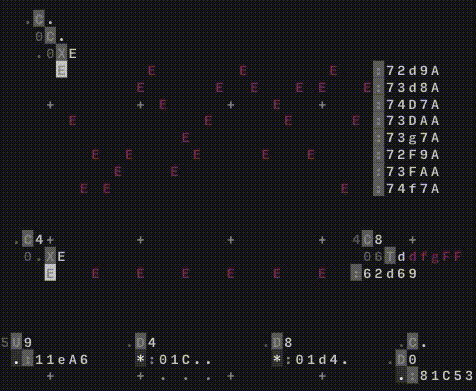

# Session 22 12 2019.md

This was our first project using ORCA. The following operators will give you a hint for what is happening. And the gif teases you the final result. The main goal was to programm a fundamental Techno track. Sythns and fine granular automation was made in an external progamm (see README for more information on that topic). The rest was played in ORCA live and recorded in midi.

## Operators

In this first session there are only a few operators used. Basically <code>D</code>, <code>C</code>, <code>X</code>, <code>T</code> and <code>U</code>.

| **D** | **C** | **X** | **T** | **U** |
| :-:   | :-:   | :-:   | :-:   | :-:   |
| Delay Bang | Count | Beamer | Tracker | Euclidean Bang |

### Delay <code>D</code>

	.D4
	 *:01C..

The first line is consists of a rate input <code>.</code> (default value (1)), the <code>D</code>-Function itself and the mod-input. The rate describes at which frame it should make a bang. The bang itself is the little <code>\*</code>-sign below the <code>D</code>, so it is <code>D</code>s output. So our <code>D</code> function bangs very fourth frame. That passes by. The speed in which the frames are passing is controlled by the BPM (Beats per minute) speed. Whereas the bang itself does not do anything on it's own, it will trigger MIDI or UDP events. You can see such a trigger in our example. It's represented by <code>:</code>. The event is followed by a few parameters. First the channel, the midi is sent to <code>0</code>. The second and third parameters is telling which octave (<code>1</code>) and note (<code>C</code>) to play.
When this example above plays, it will play a <code>1C</code> on channel <code>0</code>. This is exactly how we'll build music.

### Count <code>C</code>

	2C6
	 .

The counter function is one of the most used functions for me. It simply counts up to the maximum value given by it's clocking rate (defaults to 8/8). The default (<code>.C.</code>) of this would look like <code>1C8</code> count every frame (<code>1</code>) until you reach the 8th step <code>8</code>. Since counting starts at 0 it just runs up to 8. The number that is currently counted is passed to the bottom <code>.</code>. The given example (<code>2C6</code>) will count every second frame until reaching 5.

### Beamer <code>X</code>

	.3XE

The <code>X</code> function is a mixture between transporter and generator. One can generate events with the right-sided input. In our case it's <code>E</code>, which is an eastward running object, which will bang midis and other operators, on contact.
The first two input parmaters are corresponding horizontal and vertical (x and y) coordinates to generate the event for. and the right-sided input parameter, that will tell the writer which object to generate.
The example below illustrates the function pretty well. The counter function <code>C</code> generated a <code>1</code> in this frame. So the input for <code>X</code> is <code>13</code> and tells the function to generate <code>S</code>-objects (southwards wandering signals) at *x:1, y:3* from the <code>X</code> perspective.

	.C........
	.13XS.....
	..........
	..........
	..........
	....*.....
	....:01C34

This generator is a little special, because i'll only generate these signals/objects, when it gets a new input. So when you type this command it'll place the object, but will not release it. The release will be done, when the next (differing) parameter is arriving.

### Tracker <code>T</code>

The tracker is a function that help alot with obtaining consistency in this weird place you'r about to jump into. It basically defines and tracks variables. The tracker will run though your variables an pass it down as output (here it's <code>.</code>), because our tracker didn't start yet.

	.4TCCDD
	  .

The base expression is <code>..T</code>. The second parameter tells the <code>T</code> how many variable you want to define. For example <code>.4T....</code>. Now you can fill the four variable, created. You can either fill them with numbers or letters, depending on what you want to. Letters can form chords, numbers can be used to controll velocities or play rates. The example below uses all input parameters. The first input will determine the rate in which the track is steped though your defined variables <code>CCDD</code> at the right-side of the function.

	...2C6.........
	....26TddfgFF..
	..*:62f69......
	...............
	...............

The example seems complex but isn't. The Counter counts every <code>2</code>nd frame till <code>6</code> and delivers a number down to the <code>T</code>racker input. The tracker will then use this number as step to pass through the <code>6</code> defined variables and passes it's current state down to to midi event <code>:</code> as note to play. Like this you can obtain sequences of notes to play in a constistent manner.

### Euclidean Rhythm<code>U</code>

Euclidean rhythm is an other way to bang, based on the greatest common divisor (euclidean algorithm). If you want to know how this works, see this [article](https://en.wikipedia.org/wiki/Euclidean_algorithm). This inputs are left-sided U-step and right-sided U-max. It's default is <code>1U8</code>. For example <code>1U4</code> would bang 2 times in a 8/8 sequence, the default would bang 1 time. <code>U</code> basically counts like <code>C</code> but it's output is not a number but a bang. It just bangs on the common divisors, given step and max. This operator can bang in different sequences then <code>D</code> could, since the divisors are required to bang it. The following code would bang on <code>3U.</code> would bang on 3, 6 and 0.

	.....3U...C....
	......*...6....
	...............
	...............

