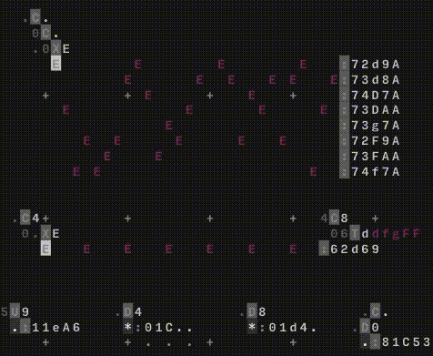

# happy-music-hacking
Programming with an esoteric programming language [ORCA](https://github.com/hundredrabbits/Orca),
as MIDI event generator, resulting in a programmatic approach to music :)

AND IT'S FUN!!! :D:D:D

Happy hacking!

Example:

## Orca overview

Orca is an esoteric programming language as stated by the inventors [hundredrabbits](http://100r.co).

Basically it's all about generating events, so called bangs. These take place within a certain frame and can generate MIDI or other events, like UDP Messages. Due to this design, Orca can be used for many things like programming music or visual components.

As a part of house of mints art project this will be a big part, since the structure and shire amounts of possibilities allow unlimited creativity (Once one got started). Orca works in a free space, unlike programming laguages usually do.

Opening orca will show an empty grid where you can type and move freely. The usage of Orca is realized with functions. There is one for every letter in the alphabet. These functions take parameters which are (in our case) represented by the underscores left, right and to the bottom of the functions letter. Originally these are shown by dots also. But you'll see when you try it out. For example *C* stands for *counter*

The output of a function is usually to the bottom. This may give you a short overview. A deeper dive will follow up in some sessions, where we explain what we did and how we did it.

## Working with Orca

In order to make music with orca, one needs to have some sort of sound source, that can work with the generated MIDI/UDP events. For getting started I recommend using [Pilot](https://github.com/hundredrabbits/pilot), but there are several other companion applications:

- [Estra](https://github.com/kyleaedwards/estra), a companion sampler tool.
- [Gull](https://github.com/qleonetti/gull), a companion sampler, slicer and synth tool.
- [Sonic Pi](https://in-thread.sonic-pi.net/t/using-orca-to-control-sonic-pi-with-osc/2381/), a livecoding environment.

If you have worked with Ableton live before, this is a very powerfull (but also expensive (very expensive)) option. Only recommanded if you'r really ambitious about this kind of stuff.

